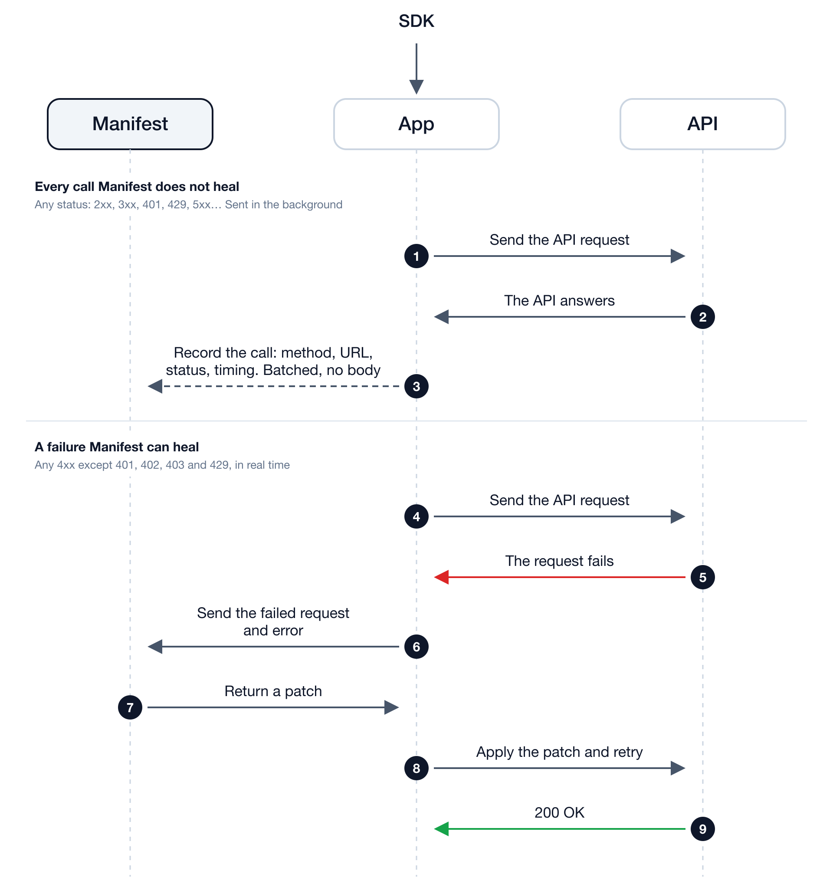

<div align="center">


# Manifest for PHP

**Keep every API connection in your app up and running.**

[](https://github.com/mnfst/manifest-php/actions/workflows/ci.yml)
[](https://packagist.org/packages/mnfst/manifest-php)
[](https://packagist.org/packages/mnfst/manifest-php)

</div>

## What is Manifest

Manifest lets you monitor all your API connections and make them more reliable.

* ⏰ **Stay ahead of breaking changes**: get warned before an API you depend on changes, so nothing breaks by surprise.
* 🎯 **Never lose a request to a bad call**: failed requests are fixed and sent again on the fly, before your users notice.
* 📡 **Know exactly how your APIs behave**: every call, every provider, every issue, live in one dashboard.

Works with internal APIs, external services and agent tools.

## How it works



Every call your app makes is reported to Manifest as metadata only (method, URL without its query string, status and timing), in batches at the end of a web request. A failure Manifest can heal is sent in full, so it can be repaired. [What is sent](docs/guide.md#data-sent-to-manifest).

## Prerequisites

- <a href="https://www.php.net/downloads" target="_blank">PHP 8.2</a> or higher
- The PHP `curl` extension, used to contact Manifest
- The <a href="https://pecl.php.net/package/opentelemetry" target="_blank">opentelemetry</a> extension:

```sh
pecl install opentelemetry && docker-php-ext-enable opentelemetry
```

In Docker, one line:

```dockerfile
RUN pecl install opentelemetry && docker-php-ext-enable opentelemetry
```

PHP cannot instrument an HTTP client without it, so the SDK sees nothing until it is installed.

## Get started

### Start with your agent

```
"Install Manifest in this app: https://dashboard.manifest.build/prompt-php.md"
```

[Read the prompt →](https://dashboard.manifest.build/prompt-php.md)

The prompt installs the extension, wires the loading order, and stops to let you paste your key.

### Start with code

```sh
composer require mnfst/manifest-php
```

Manifest must load **before your application makes its first HTTP call**. A PHP hook cannot attach
to a function that has already run, so an SDK that loads late sees nothing. Point
`auto_prepend_file` at the bundled entry point:

```ini
; php.ini, a .user.ini, or your php-fpm pool config
auto_prepend_file = vendor/mnfst/manifest-php/prepend.php
```

Or call it yourself, as the first thing your application does:

```php
use function Mnfst\manifest;

manifest();  // before any HTTP call
```

Laravel and CakePHP need no code of their own for coverage: their HTTP clients
are instrumented. In Laravel, make the call from a service provider:

```php
// app/Providers/AppServiceProvider.php
public function register(): void
{
    \Mnfst\manifest(config('services.manifest.key'), config('services.manifest.url'));
}
```

with `'manifest' => ['key' => env('MNFST_KEY'), 'url' => env('MNFST_URL')]` in
`config/services.php`. The SDK stays silent under PHPUnit and Pest, so
`Http::fake()` answers are never reported as failures; `MNFST_IN_TESTS=1` opts
back in. See [the guide](docs/guide.md#testing).

## Setup

1. Create a project in your [Manifest dashboard](https://dashboard.manifest.build) and copy its project key.
2. Set the key as an environment variable:

```sh
export MNFST_KEY='your-project-key'
```

Verify the install from your project directory:

```sh
vendor/bin/manifest doctor
```

It masks and validates the key, reports which coverage level is active, and tells you whether the
SDK is loading early enough.

## Try it

Send a request that would normally fail. Manifest catches it, repairs it, and retries:

```php
use Illuminate\Support\Facades\Http;

$response = Http::post('https://api.example.com/orders', [
    'limit' => 500,   // Invalid? Manifest fixes it and retries.
]);

echo $response->status();  // See the 200 OK response.
```

Check your [Manifest dashboard](https://dashboard.manifest.build) to see all repairs and insights.

## What is covered

| The app calls an API via… | Covered |
| --- | --- |
| Laravel's `Http` facade | ✅ healed |
| Guzzle, any client, including one built inside a third-party library | ✅ healed |
| CakePHP's `Cake\Http\Client` | ✅ healed |
| Symfony's `HttpClient` (curl & native transports) | ✅ healed |
| WordPress `wp_remote_*` / `WpOrg\Requests` | ✅ healed |
| A library with its own raw `curl_*` client, such as `stripe/stripe-php` | ⚠️ **captured, never healed** |
| `file_get_contents` | ❌ not seen |

The `curl_*` row is a permanent limit of PHP, not a temporary gap. The extension can observe an
internal function but cannot replace its return value, so those failures appear in your dashboard
while your application still receives the original error.

Symfony responses consumed through `stream()` or with `buffer => false` stay
under the caller's control and are not healed. See [the coverage details](docs/guide.md#supported-traffic).

## Supported infrastructure

| Infrastructure | Supported |
| --- | --- |
| Docker, Kubernetes | ✅ one line in the Dockerfile |
| A VPS or your own server (Forge, Ploi) | ✅ `pecl install opentelemetry` |
| Heroku, Platform.sh | ⚠️ only if the platform ships the extension |
| Laravel Vapor, Bref | ⚠️ possible with a custom Lambda layer |
| Shared hosting (cPanel, Hostinger, OVH) | ❌ you do not control the runtime |

## More

[Configuration, limits & development](docs/guide.md) · [API contract](CONTRACT.md) · [Website](https://manifest.build)
