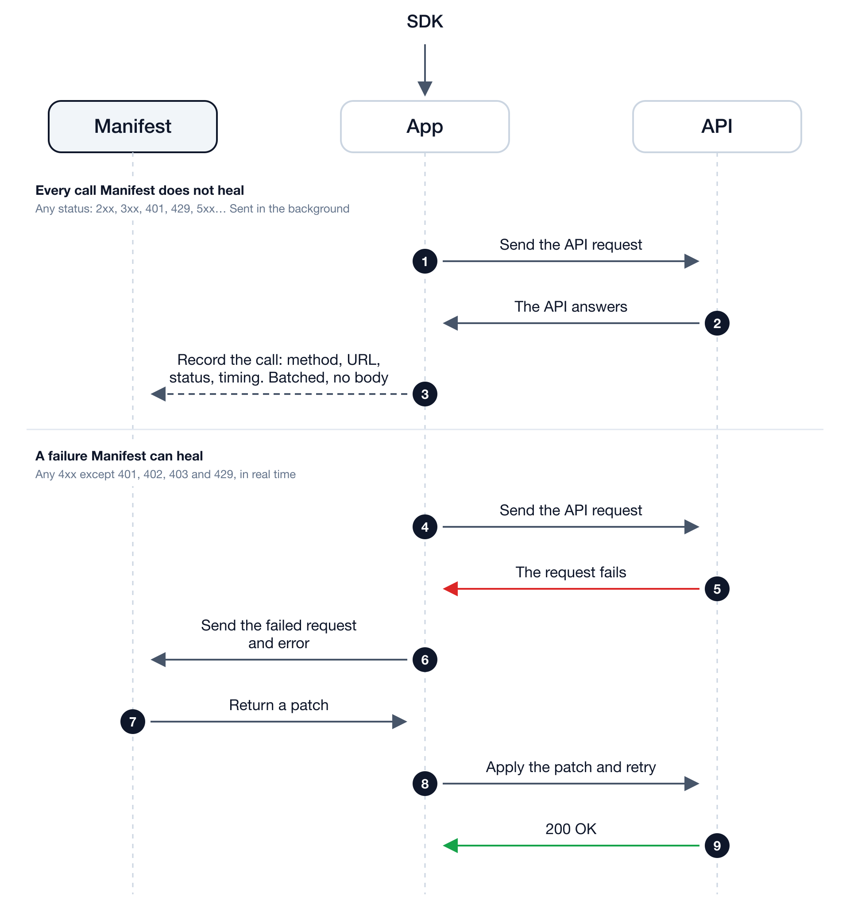

<div align="center">


# Manifest for PHP

**Turn 🔴 4xx API errors into 🟢 2xx in real time.**

[](https://github.com/mnfst/manifest-php/actions/workflows/ci.yml)
[](https://packagist.org/packages/mnfst/manifest-php)
[](https://packagist.org/packages/mnfst/manifest-php)

</div>

## What is Manifest

Manifest is a self-healing layer that fixes and retries failed API requests on the fly.

* 🎯 **Fix failures automatically** before they impact your users.
* 🔔 **Get notified of root causes** so you can fix them permanently.
* 🔌 **Works across your stack** with internal APIs, external services, and agent tools.

## How it works



Every call your app makes is reported to Manifest as metadata only (method, URL without its query string, status and timing), in batches at the end of a web request. A failure Manifest can heal is sent in full, so it can be repaired. [What is sent](docs/guide.md#data-sent-to-manifest).

## Prerequisites

- <a href="https://www.php.net/downloads" target="_blank">PHP 8.2</a> or higher
- The PHP `curl` extension, used to contact Manifest

No PHP extension to compile, nothing to change on the server.

## Get started

### Start with your agent

```
"Install Manifest in this app: https://dashboard.manifest.build/prompt-php.md"
```

[Read the prompt →](https://dashboard.manifest.build/prompt-php.md)

### Start with code

```sh
composer require mnfst/manifest-php
```

Then connect it to your HTTP client. Console commands (`artisan`, `bin/cake`,
`bin/console`, WP-CLI) are covered the same way as web requests.

**Laravel** — nothing to write. The service provider is discovered automatically
and covers every `Http::` call. The key is read from `MNFST_KEY`, or from
`config/services.php`:

```php
'manifest' => ['key' => env('MNFST_KEY'), 'url' => env('MNFST_URL')],
```

**CakePHP 5.1+** — in `src/Application.php`:

```php
public function bootstrap(): void
{
    parent::bootstrap();
    $this->addPlugin(\Mnfst\Cake\ManifestPlugin::class);
}
```

**Symfony** — in `config/bundles.php`:

```php
Mnfst\Symfony\ManifestBundle::class => ['all' => true],
```

**WordPress** — create `wp-content/mu-plugins/manifest.php`:

```php
<?php
require_once ABSPATH . 'vendor/autoload.php';   // wherever Composer installed it
\Mnfst\WordPress\listen();
\Mnfst\manifest();
```

**Any other Guzzle client** — push the middleware on its handler stack, and start the SDK once:

```php
use GuzzleHttp\Client;
use GuzzleHttp\HandlerStack;
use function Mnfst\manifest;

manifest();

$stack = HandlerStack::create();
$stack->push(\Mnfst\Guzzle\middleware());
$client = new Client(['handler' => $stack]);
```

A library that accepts a Guzzle or PSR-18 client (the AWS SDK, most API
clients) is covered when you pass it that client.

The SDK stays silent under PHPUnit and Pest, so `Http::fake()` answers are
never reported as failures; `MNFST_IN_TESTS=1` opts back in. See
[the guide](docs/guide.md#testing).

### Upgrading from 0.4

1. Remove the `auto_prepend_file` line and any `manifest()` call you added for loading order.
2. Add the line for your framework above (Laravel: nothing).
3. You can remove the `opentelemetry` extension if nothing else on the server uses it.

## Setup

1. Create a project in your [Manifest dashboard](https://dashboard.manifest.build) and copy its project key.
2. Set the key as an environment variable, or in the project's `.env` file:

```sh
export MNFST_KEY='your-project-key'
```

Verify the install from your project directory:

```sh
vendor/bin/manifest doctor
```

It reads the key from the shell, then from the project's `.env.local`, `.env` or
`config/.env`. It masks and validates the key, and checks that each framework
the project uses has its adapter in place.

## Try it

Send a request that would normally fail. Manifest catches it, repairs it, and retries:

```php
use Illuminate\Support\Facades\Http;

$response = Http::post('https://api.example.com/orders', [
    'limit' => 500,   // Invalid? Manifest fixes it and retries.
]);

echo $response->status();  // See the 200 OK response.
```

Check your [Manifest dashboard](https://dashboard.manifest.build) to see all repairs and insights.

## What is covered

| The app calls an API via… | Covered |
| --- | --- |
| Laravel's `Http` facade | ✅ healed |
| CakePHP's `Cake\Http\Client` (5.1+) | ✅ healed |
| Symfony's `HttpClient`, including scoped clients | ✅ healed |
| WordPress `wp_remote_*` | ✅ healed |
| A Guzzle client that carries the middleware | ✅ healed |
| A Guzzle client built inside a library that does not accept yours | ❌ not seen |
| Raw `curl_*`, such as `stripe/stripe-php` | ❌ not seen |
| `file_get_contents` | ❌ not seen |

Symfony responses consumed through `stream()` or with `buffer => false` stay
under the caller's control and are not healed. See [the coverage details](docs/guide.md#supported-traffic).

## Supported infrastructure

| Infrastructure | Supported |
| --- | --- |
| Docker, Kubernetes | ✅ |
| A VPS or your own server (Forge, Ploi) | ✅ |
| Heroku, Platform.sh | ✅ |
| Laravel Vapor, Bref | ✅ |
| Shared hosting (cPanel, Hostinger, OVH) | ✅ where Composer runs |

## What leaves the machine

| Call | Sent to Manifest | Never sent |
| --- | --- | --- |
| A call Manifest does not heal, whatever its status | method, scheme, host, port, path, status, timing | query string, headers, bodies |
| A failure Manifest can heal (a 4xx other than 401, 402, 403 and 429) | URL, headers, request body and error response. Credential values in the query string and headers are replaced by `REDACTED`; credential fields at the top level of the body are left out | the masked values |
| The retry | nothing: it goes to the original API, through your own client, with the real values | — |

One known limit: a secret inside a URL path (a webhook URL, `/bot<token>/`) is
sent as is. The rules are in [`src/Wire.php`](src/Wire.php) and [CONTRACT.md](CONTRACT.md).

## More

[Configuration, limits & development](docs/guide.md) · [API contract](CONTRACT.md) · [Website](https://manifest.build)
